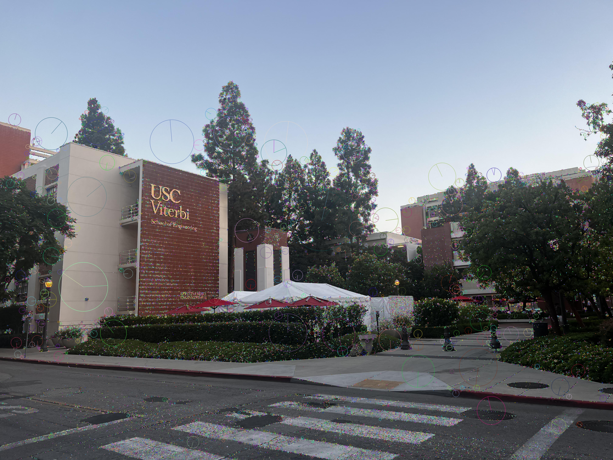

**Image Stitching and Feature Matching Using SIFT**

**Data Preparation and Preprocessing**  
After loading the input images, they were converted to grayscale for efficient feature detection using the SIFT algorithm. Grayscale images were used as they reduce the computational complexity of detecting features by focusing on intensity gradients rather than color information, which is not critical for keypoint extraction in this context.

**SIFT Feature Detection**  
The SIFT algorithm was applied to each image to extract keypoints and descriptors. SIFT can detect features that are invariant to scale, rotation, and lighting changes.

The visualization of the detected keypoints confirm that the features were well distributed across the images, particularly in overlapping areas.

**Keypoints for Given Images:**

SIFT 1  
 

SIFT 2  

SIFT 3  
  

**Feature Matching (Before RANSAC)**  
After detecting the SIFT keypoints, a brute-force matcher (BFMatcher) was used to identify corresponding keypoints between image pairs. The matching process was conducted using the descriptors from the SIFT detector, which ensures robust comparisons based on local image patches.

**Number of matches found (before RANSAC):**

The top 10 matches between each pair were visualized, highlighting strong correspondences between overlapping features in the images.

Top 10 Matches 2 and 1  

Top 10 Matches 3 and 2  

**Homography Estimation and Inliers**  
To refine the matches, RANSAC was applied to estimate the homography matrix, which allows the transformation of one image into the plane of another. This process filters out outlier matches that do not correspond to a global geometric transformation.

**Inlier matches (after RANSAC)** 

The top 10 inlier matches between each pair were visualized.

Top 10 Inliers 2 and 1  

Top 10 Inliers 3 and 2  

The resulting homography matrices are essential for transforming the images during stitching. Below are the computed homography matrices for Image pairs 21, 32 and Cumulative:

**Panorama Generation and Image Transformation**  
Using the homography matrices, the images were warped and transformed into a common plane, creating a panorama. The final transformation aligns the overlapping areas, and the images are stitched together to form a cohesive result.

Warped Image 1  

Warped Image 2  

Warped Image 3  

Panorama  

**Conclusions and Reflections**  
The combination of SIFT-based feature detection and matching, along with RANSAC-based homography estimation, worked effectively to stitch the images into a panorama. SIFT's robustness allowed for reliable keypoint detection, even with variations in scale and rotation, while RANSAC helped eliminate incorrect matches. A good alignment of the panorama image largely depended on accurate feature detection in the overlapping regions.

**Observations:**

* The number of features detected by SIFT depends on the texture and complexity of the images, with more textured areas yielding more keypoints.  
* The robustness of SIFT ensures that keypoints detected in overlapping regions between images can still be matched, even under varying conditions.  
* RANSAC plays a crucial role in ensuring that only geometrically consistent matches contribute to homography estimation, significantly improving the overall alignment.  
* The reduction in matches after RANSAC is expected as this step removes outliers that do not correspond to the estimated geometric transformation.  
* The quality of the final panorama is largely dependent on the accuracy of the homography estimation. In this case, the stitched output demonstrates successful alignment, especially in regions with significant overlap. Minor seams or misalignments are still present, particularly in areas with fewer features or where distortion occurs due to perspective changes.

**Results:**

Panorama 1
  

Panorama 2

